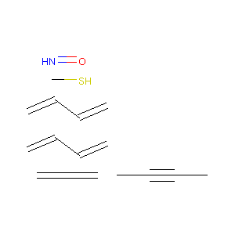
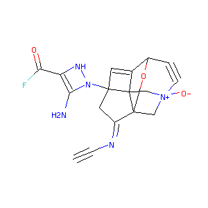

# Molecule Optimization with Monte Carlo Tree Search

We attempt to optimize the molecules generated from the GCN-K adjacency matrices using a Monte Carlo Tree Search approach.
To generate the input data, please follow the instructions from the [GCN-K repository](https://github.com/clinfo/GraphCNN)
or reach out to the person in charge from Kyoto University.

## Installation & Requirements

You can use conda for the setup. First, create a virtual environment:
```bash
conda env create -f environment.yml
```

Then use it whenever you need it:
```bash
conda activate graph_mcts
```

## File Structure

Relevant files:
- `lib/calculators.py` - Reward/Cost calculation tools
- `lib/config.py` - Configuration management scripts
- `lib/data_providers.py` - Loads, prepares and serves the molecules from the input .jbl files
- `lib/data_structures.py` - Data models and resources for compounds, nodes, and trees
- `lib/filters.py` - Filter implementations
- `lib/helpers.py` - Helper classes (ie: drawing molecules)
- `lib/models.py` - Monte Carlo Tree Search implementation
- `environment.yml` - Requirements and dependencies
- `run.py` - Command-line interface. You use this file to run the optimizer.

Trivial files:
- `data/*` - Sample datasets and configuration files
- `img/*` - Sample molecules generated (used in this readme)

## Configuration

To run the code, you will need to have a configuration file (in JSON format). An example was included in `data/config.json`:
The options are (details for each option can be found below):

- **dataset**: path to the dataset file (jbl file, output of GCN-K) (mandatory)
- **generate**: how many molecules to generate (default: 10) 
- **threshold**: Minimum threshold for potential bonds (default: 0.15)
- **monte_carlo_iterations**: How many times to iterate over the tree (default: 1000)
- **minimum_output_depth**: The output needs at least this many bonds (default: 20)
- **output_type**: Options: fittest | deepest | per_level (default: fittest)
- **breath_to_depth_ratio**: Optimize for exploitation or exploration (default: 1)
- **reward_calculator**: How is the cost calculated? See below for a full list of options. (default: compound_energy_babel_mmff)
- **filters**: If any of these filters are met, the cost is set to infinity. Multiple options can be specified. Options: non_zero_reward, positive_reward, molecular_weight (default: ["positive_reward","molecular_weight"])
- **draw**: If specified, will draw the molecules to this folder (default: null)
- **logging**: Logging level. Smaller number means more logs (use increments of 10, between 10 and 50) (default: 50)


## Usage

`run.py` is the entry point for the optimizer. You can use it like this:
```bash
python run.py {config_file}
```

### threshold

The adjacency matrix provided by GCN-K has a specific structure. For each molecule, each atom has a probability
to be of a certain type (ie: atom #1 could have a 70% chance to be C, 20% to be O and 10% to be one of the other 
42 types the model allows). Similarly, each atom pair has a certain probability to have a bond between them.

With this threshold, you can control the minimum value required to consider a bond. As it is a percentage, 
it accepts values between 0 and 1

A large threshold will have a very small bond-to-atom ratio, while a very small one will have a very high one. This
will result in sparse, several small molecules in the first case, or very unstable molecules in the second one. 
Values between 0.10 and 0.15 seem to work best.


*threshold=0.25, too big*


*threshold=0.05, too small*

### monte_carlo_iterations
Monte Carlo Tree Search is an optimization algorithm that runs for an infinite number of iterations. 
Use this parameter to specify when to stop.

In our approach, we start from the set of atoms, with no bonds between them and add a new one in each iteration.
If the parameter is too small, it might not be enough to add enough bonds to form a large molecule or an optimal one.

Generally, the deepest levels of the tree are not yet good enough because only a few iterations had the opportunity 
to expand on them.

Note: this parameter influences execution time the most

### reward_calculator

The reward calculator option specifies how the cost/reward is calculated. The objective is to minimize this cost. Calculators can
be divided into 3 categories:

#### 1. Basic energy calculators

The energy of the molecule is used as reward for the algorithm. The smaller the energy, the better.
To calculate the energy we need to create a force field, and there are 2 types of implementation for 
supported force fields: rdkit force fields and open babel force fields.

The 7 options available are:

- `compound_energy_rdkit_uff` - The [Universal Force Field](https://doi.org/10.1021/ja00051a040) is an all atom potential which considers 
only the element, the hybridization and the connectivity (implemented in rdKit)
- `compound_energy_rdkit_mmff` - The [Merck Molecular Force Field](https://doi.org/10.1002/(SICI)1096-987X(199604)17:5/6<490::AID-JCC1>3.0.CO;2-P) 
is similar to the [MM3 Force Field](https://doi.org/10.1021/ja00205a001) (implemented in rdKit)
- `compound_energy_babel_uff` - The same [Universal Force Field](https://doi.org/10.1021/ja00051a040) (implemented in OpenBabel)
- `compound_energy_babel_mmff` - The same [Merck Molecular Force Field](https://doi.org/10.1002/(SICI)1096-987X(199604)17:5/6<490::AID-JCC1>3.0.CO;2-P)
(implemented in OpenBabel)
- `compound_energy_babel_mmffs` - [MMFF94S](https://doi.org/10.1002/(SICI)1096-987X(199905)20:7%3C720::AID-JCC7%3E3.0.CO;2-X) is 
a "static" variant of the MMFF force field. (implemented in OpenBabel)
- `compound_energy_babel_gaff` - The [Generalized Amber Force Field](https://doi.org/10.1002/jcc.20035) (implemented in OpenBabel)
- `compound_energy_babel_ghemical` - The [Ghemical Force Field](https://open-babel.readthedocs.io/en/latest/Forcefields/ghemical.html) (implemented in OpenBabel)

#### 2. Atom-wise energy calculators

The same options are available under these calculators as well, but the energy output is divided by the number of atoms.
That is, `atomwise energy = compound energy / atom count`:

- `atomwise_energy_rdkit_uff`
- `atomwise_energy_rdkit_mmff`
- `atomwise_energy_babel_uff`
- `atomwise_energy_babel_mmff`
- `atomwise_energy_babel_mmffs`
- `atomwise_energy_babel_gaff`
- `atomwise_energy_babel_ghemical`

#### 3. Property calculators:

Everything else, not energy calculation related.

- `log_p` - The octanol/water partition coefficient. (exact formula = `max(LogP - 5, 0)`)
- `qed` - The Quantitative Estimate of Drug-likeness score (exact formula = `1 - qed`)
- `sa` - The Synthetic Accessibility score (no modifications made to the base score)
- `mw` - The Molecular Weight (no modifications made to the base score)
- `ring_count` - Number of rings present: (exact formula = `-(ring_count)`)


Modifications to the formulas can be easily added (`lib/calculators.py`)    


### filters

More than 1 filter can be specified at the same time. If the filter conditions are not met, the compound will not
be included in the final node selection. Depending on the reward calculator used, it might be helpful to specify 
one or more filters. The list of currently available filters is:

1. "non_zero_reward": Filters out all null/zero rewards
2. "positive_reward": Filters out all rewards below zero
3. "molecular_weight": Filter out all molecules with a molecular weight outside the 300-500 range

#### 1. Non Zero Reward Filter - Tips

- Energy calculators can benefit from this filter. Although this is the result we aim for, if the energy is 0
then the compound is likely to be very small
- Property calculators don't benefit from this filter, except for some special circumstances (ie: we don't want
compounds without any rings for example)

#### 2. Positive Reward Filter - Tips

- Some energy calculators can return negative values. These are not helpful, so it can be beneficial to use this 
filter with energy calculators
- Some rewards have been negated to comply with the minimization process. The "ring_count" for example will always
be a negative value, so it will not work with this filter.
- Other calculators are always positive (ie: mw, qed), so the filter is redundant.

#### 3. Molecular Weight Filter - Tips

- This filter can be used with any calculator, but note that many early (small depth) molecules will be filtered out.
If no results are printed, try to adjust some of the other settings like the "minimum_output_depth", "threshold" or the
number of "monte_carlo_iterations"

### output_type
We implemented 3 different ways to select the output/best solution:

- **fittest** - Will output the molecule with the smallest energy. But note, smaller molecules tend to be more stable and have smaller energy, thus this approach tends to output only a C-C molecule or something similar. 
Always use this option along with the "minimum_output_depth" parameter. 

- **deepest** - This approach will output the fittest molecule, but only if it is a node from the deepest level of the tree. The molecules from the deepest levels are usually not stable enough since the states haven't 
been visited many times.

- **per_level** - Several molecules will be printed, one for the best molecule from each level of the tree. 
Since the tree can become very deep, it is recommended to use this option along with "minimum_output_depth" as well.    

### minimum_output_depth
Sets the minimum tree level to look at when picking the winner. 
Nodes with depth smaller than "minimum_output_depth" are ignored.

### breath_to_depth_ratio
Molecule energy is not a good way to select the node to expand since it tends to favor smaller molecules.
The best working solution we found is a two-factor pseudo-random one.

##### Step 1
We perform a weighted random choice for the level to perform the expansion based on the "breath_to_depth_ratio".
The higher the value, the more "random" the selection will be. Lower values will result in a values that are 
more skewed towards deeper levels. To achieve an opposite effect, use a negative value:

As an example, assuming our tree currently has a depth/level of 5. The following "breath_to_depth_ratio" values might
produce similar probabilities:

| breath_to_depth_ratio | level1 % | level2 % | level3 % | level4 % | level5 % |
| --------------------- | -------- | -------- | -------- | -------- | -------- |
| 0.5                   | 0.000047 | 0.000062 | 0.003793 | 0.360444 | 0.635651 |
| 1                     | 0.048671 | 0.087203 | 0.160737 | 0.291216 | 0.412170 |
| 10                    | 0.106983 | 0.171757 | 0.180209 | 0.217732 | 0.323316 |
| 100                   | 0.188933 | 0.192691 | 0.201109 | 0.208459 | 0.208805 |
| -0.1                  | 0.993638 | 0.006341 | 0.000014 | 0.000006 | 0        |
| -1                    | 0.410542 | 0.334045 | 0.138279 | 0.111738 | 0.005394 |
| -10                   | 0.219435 | 0.219109 | 0.204048 | 0.184172 | 0.173234 |
| -100000               | 0.200854 | 0.200463 | 0.200139 | 0.200045 | 0.198496 |

We recommend using low, positive values.

##### Step 2
Once a level is selected, we perform a weighted random choice based on the fitness of each node in the level.

### logging
The value of this parameter is an integer (use increments of 10). When the value is:
- 10 - everything is usually logged, including energy calculations and exceptions
- 20 - only the molecules output and its energy is logged
- 30+ - only the result is logged

## Drawing 3D structures
A helper script was included which can be used to visualize molecules in 3D. In order to use the script,
a PyMol server must be running on the host machine. You may start the server by opening a new terminal and running:

```bash
conda activate graph_mcts
pymol -R
```

Then from a separate terminal:
```bash
conda activate graph_mcts
python -m scripts.draw_3d {input_file} {output_directory}
```
where:
 - {input_file} contains SMILES (one per line)
 - {output_directory} is the folder where the generated images are saved in

## Issues:

- The OpenBabel MMFF94 Force Field ocassionally causes memory corruption (as of version 2.4.1)

## Version
0.2.1